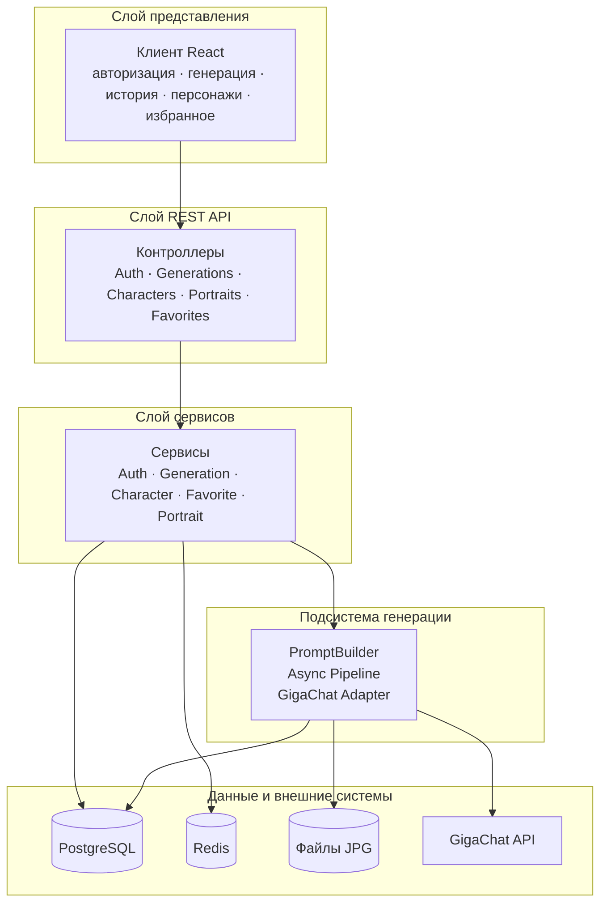
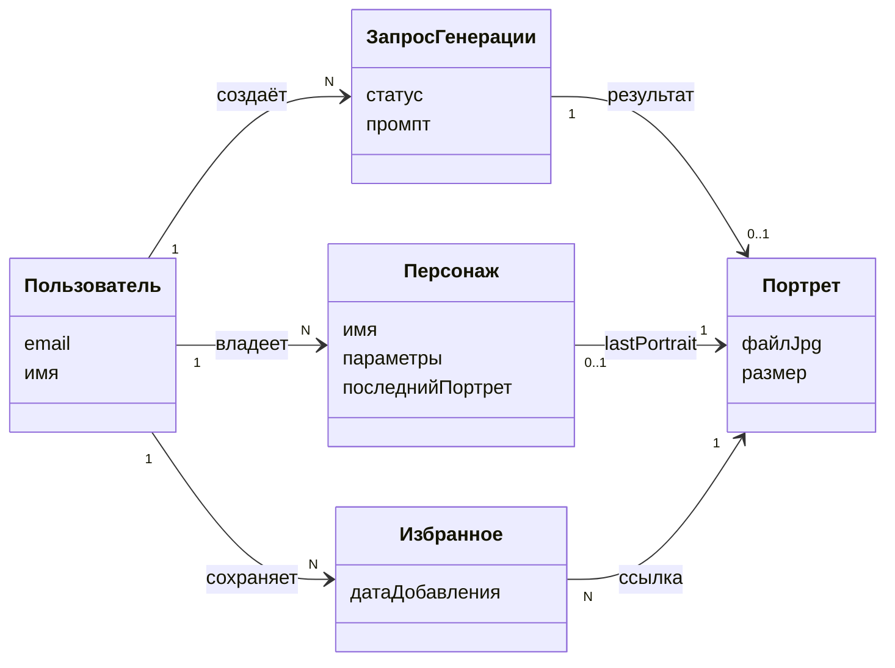

# Диаграмма классов для слайда

Концептуальная схема backend (упрощённая, для презентации).  
На слайд удобнее вставлять **вариант 1** (блоки) или скопировать **вариант 2** (ASCII) в фигуры PowerPoint.

---

## Вариант 1 — блоки (Mermaid)

Скопируйте в [mermaid.live](https://mermaid.live) → Export PNG/SVG → вставка на слайд.



---

## Вариант 2 — ASCII (для фигур PowerPoint)

```
┌─────────────────────────────────────────────────────────────┐
│                    КЛИЕНТ (React)                           │
│         авторизация · генерация · история · избранное       │
└─────────────────────────────┬───────────────────────────────┘
                              │ HTTPS
┌─────────────────────────────▼───────────────────────────────┐
│                    REST API (контроллеры)                   │
└─────────────────────────────┬───────────────────────────────┘
                              │
┌─────────────────────────────▼───────────────────────────────┐
│                    СЕРВИСЫ (бизнес-логика)                  │
│      Auth · Generation · Character · Favorite · Portrait    │
└──────────────┬──────────────────────────────┬───────────────┘
               │                              │
┌──────────────▼──────────────┐   ┌───────────▼───────────────┐
│   ГЕНЕРАЦИЯ                 │   │   ХРАНЕНИЕ                │
│   PromptBuilder             │   │   PostgreSQL · Redis      │
│   Async Pipeline            │   │   Файлы портретов (JPG)   │
│   Адаптер GigaChat          │───▶   GigaChat API (внешний)  │
└─────────────────────────────┘   └───────────────────────────┘
```

---

## Вариант 3 — доменные сущности (если нужна именно «классовая» модель данных)



---

## Подпись под слайдом (1 строка)

**Архитектура DD Person:** React-клиент → REST API → сервисы → async-генерация (GigaChat) → PostgreSQL, Redis и файловое хранилище.
