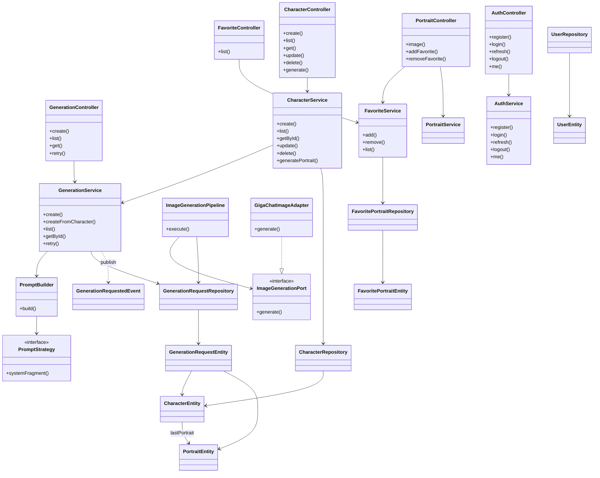

# Диаграмма классов (основные слои)

Упрощённая диаграмма ключевых классов backend.



## Пакеты

```
ddperson.api          — контроллеры, DTO, мапперы
ddperson.service      — сценарии использования
ddperson.generation   — промпты и pipeline
ddperson.gigachat     — интеграция GigaChat
ddperson.persistence  — JPA-сущности и репозитории
ddperson.security     — JWT, cookies, фильтры
ddperson.redis        — rate limit, blacklist
ddperson.storage      — файлы JPG
```
