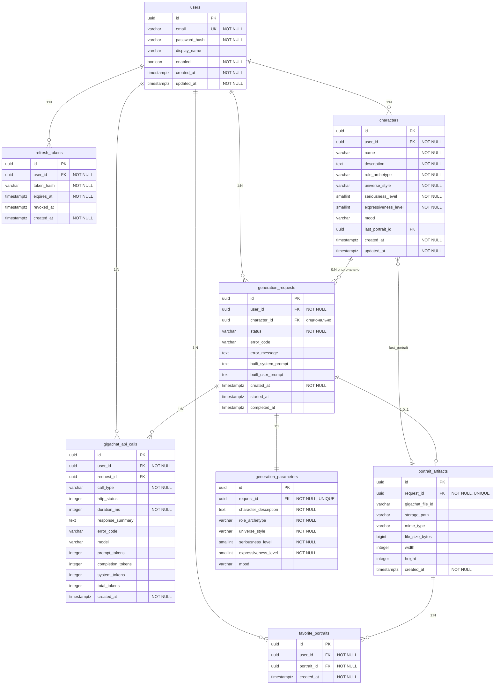

# ER-диаграмма базы данных

Логическая модель PostgreSQL проекта DD Person. Схему в runtime создаёт Hibernate по JPA-сущностям (`ddl-auto: update`). Справочный DDL: [db/reference-schema.sql](db/reference-schema.sql).

Файлы JPG хранятся на диске (`storage/portraits/`), в БД — только метаданные в `portrait_artifacts`.

## Связи

| Связь | Кардинальность | Назначение |
|-------|----------------|------------|
| `users` → `refresh_tokens` | 1:N | Сессии входа (refresh JWT) |
| `users` → `characters` | 1:N | Шаблоны персонажей пользователя |
| `users` → `generation_requests` | 1:N | История запросов генерации |
| `users` → `favorite_portraits` | 1:N | Избранные портреты |
| `users` → `gigachat_api_calls` | 1:N | Аудит вызовов GigaChat |
| `characters` → `generation_requests` | 0:N | Опционально: генерация по шаблону (обновление `last_portrait`) |
| `characters` → `portrait_artifacts` | 0:1 | Последний портрет шаблона |
| `generation_requests` → `generation_parameters` | 1:1 | Входные параметры запроса |
| `generation_requests` → `portrait_artifacts` | 1:0..1 | Результат (после `COMPLETED`) |
| `generation_requests` → `gigachat_api_calls` | 1:N | Логи вызовов по запросу |
| `portrait_artifacts` → `favorite_portraits` | 1:N | Один портрет у нескольких пользователей невозможен; у пользователя — уникальная пара `(user_id, portrait_id)` |

## Ограничения

- `users.email` — уникальный.
- `generation_parameters.request_id` — уникальный (один набор параметров на запрос).
- `portrait_artifacts.request_id` — уникальный (один портрет на запрос).
- `favorite_portraits (user_id, portrait_id)` — уникальная пара.

## Группы таблиц

| Группа | Таблицы |
|--------|---------|
| Авторизация | `users`, `refresh_tokens` |
| Персонажи | `characters` |
| Генерация | `generation_requests`, `generation_parameters`, `portrait_artifacts` |
| Избранное | `favorite_portraits` |
| Аудит | `gigachat_api_calls` |

## Связанные материалы

- [database.md](database.md) — как создаётся схема и выполняются запросы
- [class-diagram.md](class-diagram.md) — диаграмма классов backend
- [db/example-queries.sql](db/example-queries.sql) — примеры SELECT
