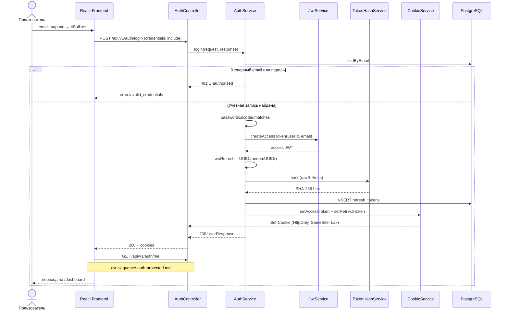

# Sequence: вход

Выдача JWT и refresh-токена в HttpOnly cookies.

## Связанные диаграммы

- [sequence-auth-protected.md](sequence-auth-protected.md) — проверка cookie на запросах
- [sequence-auth.md](sequence-auth.md) — оглавление
