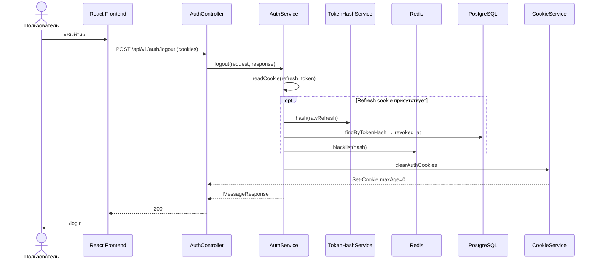

# Sequence: выход

Отзыв refresh-токена и очистка cookies.

```mermaid
sequenceDiagram
    actor User as Пользователь
    participant UI as React Frontend
    participant API as AuthController
    participant Svc as AuthService
    participant Hash as TokenHashService
    participant Redis as Redis
    participant DB as PostgreSQL
    participant Cookie as CookieService

    User->>UI: «Выйти»
    UI->>API: POST /api/v1/auth/logout (cookies)
    API->>Svc: logout(request, response)

    Svc->>Svc: readCookie(refresh_token)
    opt Refresh cookie присутствует
        Svc->>Hash: hash(rawRefresh)
        Svc->>DB: findByTokenHash → revoked_at
        Svc->>Redis: blacklist(hash)
    end
    Svc->>Cookie: clearAuthCookies
    Cookie-->>API: Set-Cookie maxAge=0
    Svc-->>API: MessageResponse
    API-->>UI: 200
    UI-->>User: /login
```

## Связанные диаграммы

- [sequence-auth-login.md](sequence-auth-login.md) — вход
- [sequence-auth.md](sequence-auth.md) — оглавление
