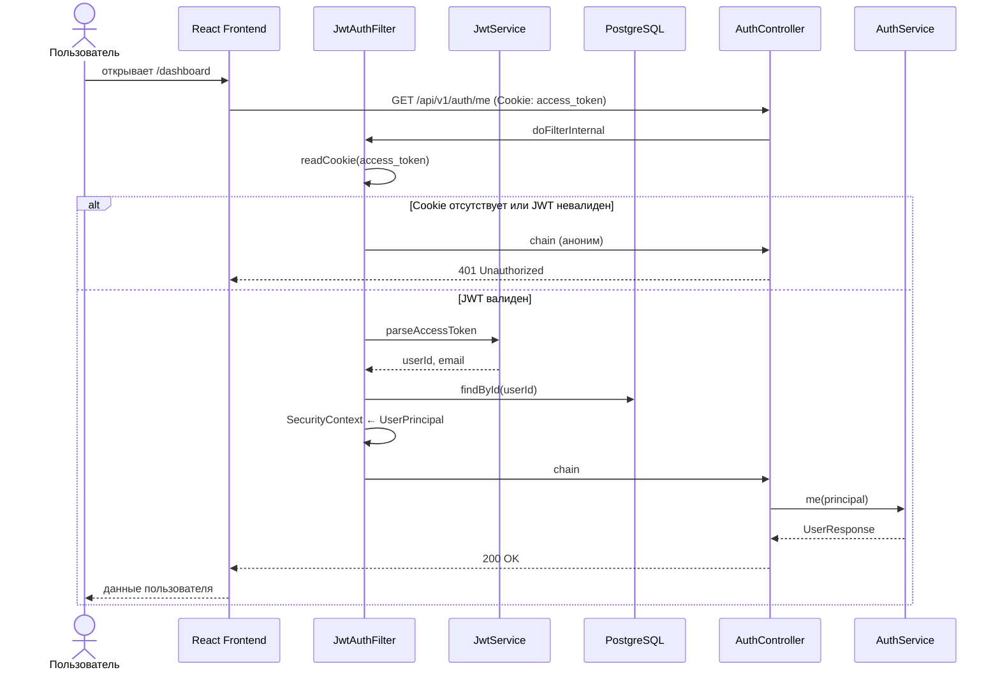

# Sequence: защищённый запрос

Как `JwtAuthFilter` проверяет cookie `access_token` перед доступом к `/api/v1/**`.

## Связанные диаграммы

- [sequence-auth-login.md](sequence-auth-login.md) — откуда берётся cookie
- [sequence-auth.md](sequence-auth.md) — оглавление
