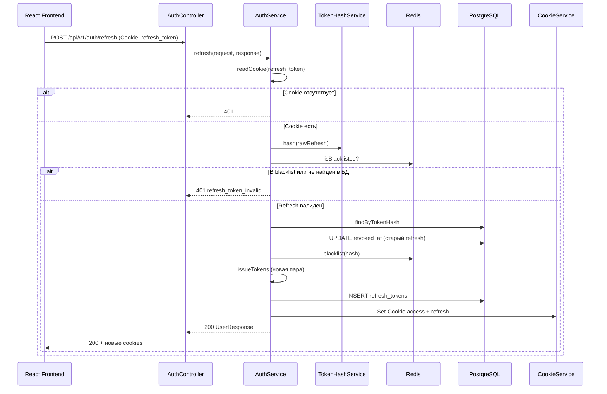

# Sequence: обновление access token

Ротация refresh-токена при истечении access JWT.

## Связанные диаграммы

- [sequence-auth-logout.md](sequence-auth-logout.md) — выход
- [sequence-auth.md](sequence-auth.md) — оглавление
