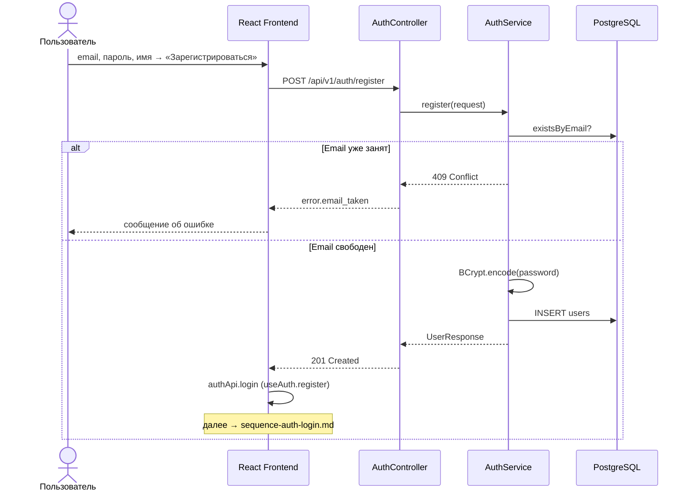

# Sequence: регистрация

Создание нового пользователя. Cookies **не выдаются** — после успеха frontend автоматически вызывает [вход](sequence-auth-login.md).

## Связанные диаграммы

- [sequence-auth-login.md](sequence-auth-login.md) — вход после регистрации
- [sequence-auth.md](sequence-auth.md) — оглавление
