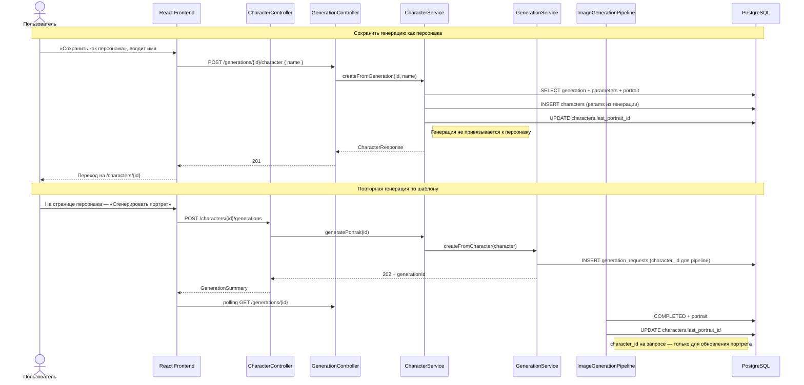

# Sequence: персонажи

Шаблоны персонажей отделены от истории генераций: из генерации можно создать персонажа в любой момент; повторная генерация по шаблону обновляет `lastPortrait`.

## Участники

| Компонент | Роль |
|-----------|------|
| `CharacterService.createFromGeneration` | Копирует параметры и портрет в новый шаблон |
| `GenerationService.createFromCharacter` | Создаёт запрос с `character_id` для async pipeline |
| `ImageGenerationPipeline` | После успеха обновляет `lastPortrait` персонажа |

## Связанные диаграммы

- [sequence-generation.md](sequence-generation.md) — async pipeline GigaChat
- [sequence-favorites.md](sequence-favorites.md) — избранное
