# Sequence: избранное

Добавление, просмотр и удаление понравившихся портретов (только результаты генераций).

```mermaid
sequenceDiagram
    actor User as Пользователь
    participant UI as React Frontend
    participant GenAPI as GenerationController
    participant PortAPI as PortraitController
    participant FavAPI as FavoriteController
    participant FavSvc as FavoriteService
    participant PortSvc as PortraitService
    participant DB as PostgreSQL

    Note over User,DB: Добавление в избранное

    User->>UI: На странице генерации — «В избранное»
    UI->>GenAPI: GET /generations/{id}
    GenAPI-->>UI: portrait.id
    UI->>PortAPI: POST /portraits/{portraitId}/favorite
    PortAPI->>FavSvc: add(portraitId)
    FavSvc->>PortSvc: getOwnedPortrait(portraitId)
    FavSvc->>DB: INSERT favorite_portraits
    FavSvc-->>PortAPI: MessageResponse
    PortAPI-->>UI: 201

    Note over User,DB: Список избранного

    User->>UI: Открывает /favorites
    UI->>FavAPI: GET /favorites?page=0
    FavAPI->>FavSvc: list(page, size)
    FavSvc->>DB: SELECT favorites + portrait + generation params
    FavSvc-->>FavAPI: описание, роль, вселенная, generationId
    FavAPI-->>UI: PageResponse
    UI-->>User: Карточки портретов (без персонажей)

    User->>UI: Клик по карточке
    UI->>GenAPI: GET /generations/{generationId}
    GenAPI-->>UI: детали генерации

    Note over User,DB: Удаление из избранного

    User->>UI: «Убрать»
    UI->>PortAPI: DELETE /portraits/{portraitId}/favorite
    PortAPI->>FavSvc: remove(portraitId)
    FavSvc->>DB: DELETE favorite_portraits
    FavSvc-->>PortAPI: MessageResponse
    PortAPI-->>UI: 200
```

## Особенности

- В избранное попадают только портреты из `portrait_artifacts` (результаты генераций).
- В карточке отображаются параметры генерации (описание, роль, вселенная), а не шаблон персонажа.
- Переход с карточки ведёт на страницу генерации `/generations/{id}`.

## Связанные диаграммы

- [sequence-generation.md](sequence-generation.md) — генерация портрета
- [sequence-characters.md](sequence-characters.md) — персонажи
