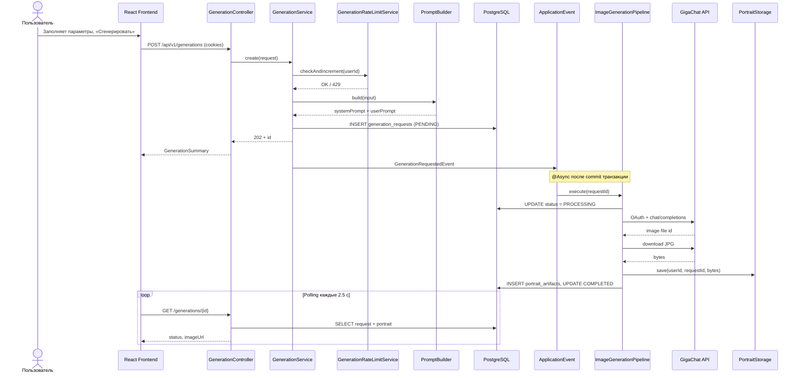

# Sequence: генерация портрета

Асинхронный сценарий от формы до JPG.

## Участники

| Компонент | Роль |
|-----------|------|
| `PromptBuilder` | Strategy + Builder: system/user промпт |
| `GenerationRateLimitService` | Redis: лимит запросов в день/час |
| `GigaChatImageAdapter` | Port/Adapter к GigaChat |
| `PortraitStorageService` | JPG на диск |

## Связанные диаграммы

- [sequence-favorites.md](sequence-favorites.md) — избранное
- [sequence-characters.md](sequence-characters.md) — персонажи и генерация по шаблону
